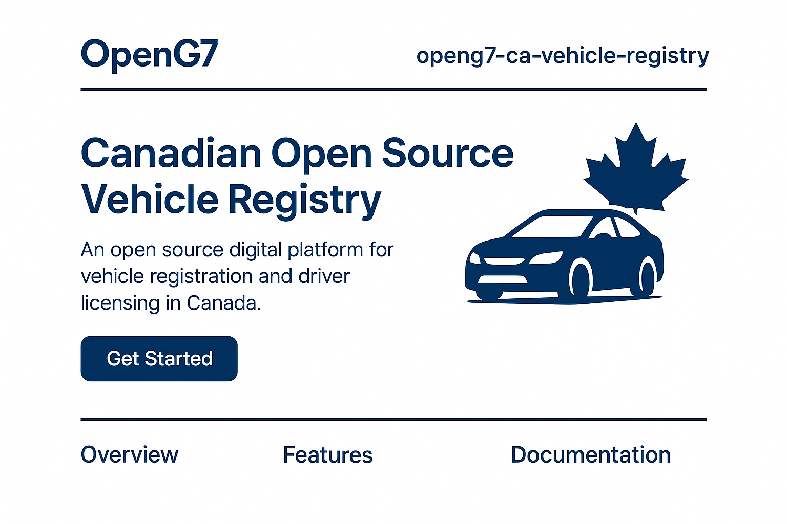

# OpenG7 - Canadian Vehicle Registry

**Languages:** [English](#english) | [Français](#francais)

---

## 🇬🇧 English

### Overview
`openg7-ca-vehicle-registry` is an **open source digital platform** designed to unify and modernize vehicle registration, driver licensing, and related road services across Canadian provinces and territories.  
Inspired by the challenges faced in existing provincial systems (e.g. SAAQclic), this project aims to provide a **transparent, reliable, and collaborative** alternative.

### Objectives
- **Unify**: Create a single open-source foundation adaptable for all provinces and territories.  
- **Modernize**: Replace outdated or fragmented systems with a cloud-ready, API-first solution.  
- **Open Source**: Encourage collaboration from developers, governments, and citizens.  
- **Interoperability**: Ensure data can be securely shared across provincial and federal levels.  

### Features
- Vehicle registration (new, renewals, transfers)  
- Driver’s license issuance and renewal  
- Integration with insurance providers  
- Online self-service portal (web & mobile)  
- Transparent APIs for third-party integrations  
- Bilingual by design (English & French)  

### Technical Stack (proposed)
- **Frontend**: Angular 19.x (Signal-first architecture, TailwindCSS 4.x, NgRx)  
- **Backend**: NestJS / Node.js  
- **Database**: PostgreSQL (with PostGIS for geodata)  
- **APIs**: REST + GraphQL + OpenAPI specs  
- **Hosting**: Canadian cloud infrastructure (OVHcloud, etc.)  

### Get Involved
This repository is open to developers, public servants, academics, and citizens who wish to **build a better digital public service**.  
- Fork and contribute to the codebase  
- Propose issues or feature requests  
- Participate in design discussions  

### License
Apache 2.0 — ensuring open collaboration while protecting contributors.  

---

## 🇫🇷 Français

### Aperçu
`openg7-ca-vehicle-registry` est une **plateforme numérique open source** conçue pour unifier et moderniser l’immatriculation des véhicules, la délivrance des permis de conduire et les services routiers connexes dans toutes les provinces et territoires du Canada.  
Inspiré par les difficultés rencontrées dans certains systèmes provinciaux (ex. SAAQclic), ce projet vise à offrir une alternative **transparente, fiable et collaborative**.

### Objectifs
- **Unifier** : Créer une fondation open source unique et adaptable pour toutes les provinces et territoires.  
- **Moderniser** : Remplacer les systèmes désuets ou fragmentés par une solution moderne prête pour le cloud et API-first.  
- **Open Source** : Encourager la collaboration entre développeurs, gouvernements et citoyens.  
- **Interopérabilité** : Assurer un partage sécurisé des données entre les niveaux provincial et fédéral.  

### Fonctionnalités
- Immatriculation des véhicules (nouvelle, renouvellement, transfert)  
- Délivrance et renouvellement des permis de conduire  
- Intégration avec les assureurs  
- Portail libre-service en ligne (web & mobile)  
- APIs transparentes pour intégrations tierces  
- Bilingue dès la conception (anglais et français)  

### Pile technologique (proposée)
- **Frontend** : Angular 19.x (architecture signal-first, TailwindCSS 4.x, NgRx)  
- **Backend** : NestJS / Node.js  
- **Base de données** : PostgreSQL (avec PostGIS pour les données géographiques)  
- **APIs** : REST + GraphQL + OpenAPI specs  
- **Hébergement** : Infrastructure cloud canadienne (OVHcloud, etc.)  

### Contribuer
Ce dépôt est ouvert aux développeurs, fonctionnaires, chercheurs et citoyens souhaitant **bâtir un meilleur service public numérique**.  
- Forkez et contribuez au code  
- Proposez des issues ou demandes de fonctionnalités  
- Participez aux discussions de conception  

### Licence
Apache 2.0 — favorise une collaboration ouverte tout en protégeant les contributeurs.  

